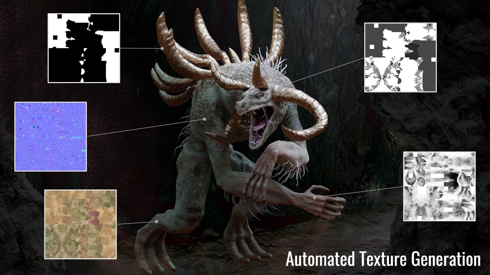
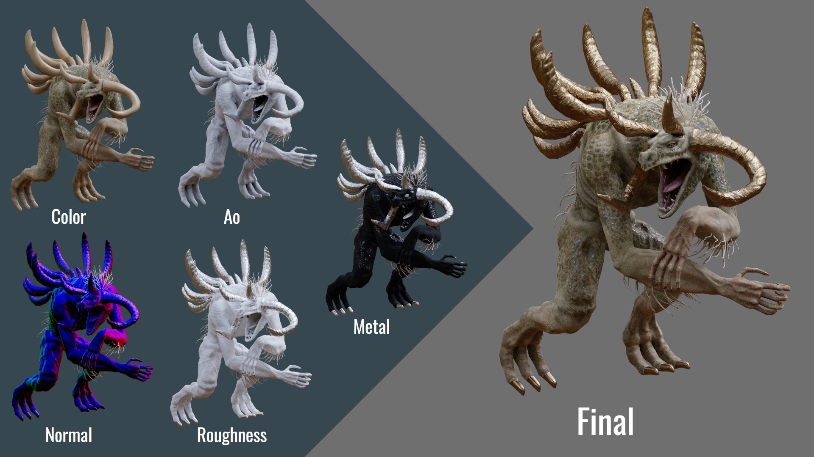
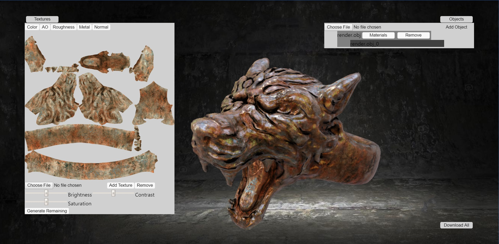

An artist-centered tool to aid in the online, automatic generation of game-ready textures from user photos.

This project was originally created as part of Imperial College London's 2nd year web applications project, and is currently being developed as a standalone product.

Original Development:
[Anindita Ghost](https://github.com/anindita), [Zelie Everest](https://github.com/Zeverest), [Rasika Navarange](https://github.com/rasikanavarange), [Penelope Tay](https://github.com/Ozeuth).

Current Development and [3D Models](https://www.artstation.com/ozeuth):
[Penelope Tay](https://github.com/Ozeuth)

### Description

In Games Development, different texture maps give 3D models unique properties, contributing to the overall detail and realism of the game. These textures are often hard to manually generate, or require software locked behind paywalls or large downloads.

As an artist, this tool lets you generate all these different textures from one base image. Simply upload an image, that will serve as the base color texture. Then, set Fabriqate to automatically generate the remaining textures. Based on its analysis of your texture, it will generate the following range of textures: ambient occlusion, roughness, metal and normal. 
These images can then be downloaded and immediately plugged into your game.

### Development
Currently, this project is not hosted online. Additional features, UI improvements and bug fixes must be done, before it can become a public service.
#### Current Features
1. Persistent Storage  
Each user has their own account and individual projects, storing all their past work.
2. Object Support  
Upload your own .obj files to help view preview your generated textures. Projects can have multiple objects with their own textures.
3. Material Support  
Uploaded objects can have multiple materials allocated. You may generate individual textures for each material allocation.
4. Personal Texture Support  
If users want to use a mix of their own textures as well as generated ones. They may upload their own ao/rough/metal/normal...etc textures. Fabriqate will generate any missing textures. Users may also replace textures generated by Fabriqate with your own textures. Bear in mind personal textures cannot be edited.
5. Texture Editing Support  
Generated textures can be edited through sliders controlling basic aspects of that texture.

To keep track of development, you may watch the Fabriqate repo.
